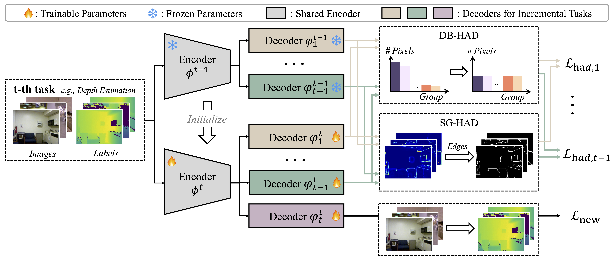

# HAD

Official PyTorch implementation of **HAD** for heterogeneous continual learning on dense visual prediction tasks.

The current release trains a shared ResNet/DeepLabV3 network on NYUv2 in the following continual task order:

1. semantic segmentation
2. depth estimation
3. surface normal estimation

At each new stage, HAD learns the current task while using predictions from the frozen model of the previous stage to preserve earlier capabilities.



## Repository structure

```text
.
├── main.py                    # Command-line entry point
├── trainer.py                 # Continual training loop
├── continual_model.py         # Shared backbone and task decoders
├── methods/had.py             # HAD learner
├── model/                     # ResNet and DeepLabV3 components
├── datasetting/               # NYUv2 loader, transforms, and losses
├── utils/                     # Base model utilities
└── figures/framework.png      # Method overview
```

## Requirements

- Python 3.8+
- A CUDA-capable GPU
- PyTorch and torchvision with CUDA support
- NumPy
- OpenCV (`opencv-python`)
- Pillow
- SciPy
- scikit-image
- six
- tqdm
- Matplotlib

One way to create the environment is:

```bash
conda create -n had python=3.10 -y
conda activate had

# Install the PyTorch build appropriate for your CUDA version first:
# https://pytorch.org/get-started/locally/

pip install numpy opencv-python pillow scipy scikit-image six tqdm matplotlib
```

The backbone loads ImageNet-pretrained ResNet weights through PyTorch on first use, so the first run may require internet access.

## Dataset

This release uses the preprocessed **NYUv2** data format adopted by [MTSAM](https://github.com/XuehaoWangFi/MTSAM). Arrange the files as follows:

```text
/data/dataset/nyuv2/
├── train/
│   ├── image/{index}.npy
│   ├── label/{index}.npy
│   ├── depth/{index}.npy
│   └── normal/{index}.npy
└── val/
    ├── image/{index}.npy
    ├── label/{index}.npy
    ├── depth/{index}.npy
    └── normal/{index}.npy
```

The dataset root is currently set to `/data/dataset/nyuv2` in `datasetting/continual_dataset.py`. If your data is elsewhere, update the two NYUv2 paths in that file or create a symbolic link.

The training set is split evenly across the three continual stages. The validation set is used in full after every stage.

## Running

Run the default NYUv2 experiment on GPU 0:

```bash
python main.py
```

Example with commonly adjusted options:

```bash
python main.py \
  --dataset NYUv2 \
  --model resnet18 \
  --batch_size 64 \
  --epoch 20 \
  --lr 1e-4 \
  --seed 4 \
  --aug
```

Main options:

| Argument | Default | Description |
| --- | ---: | --- |
| `--dataset` | `NYUv2` | Dataset configuration; the included data loader currently supports NYUv2 |
| `--model` | `resnet18` | ResNet backbone |
| `--method` | `had` | Continual learning method |
| `--batch_size` | `64` | Training and evaluation batch size |
| `--epoch` | `20` | Epochs per continual stage |
| `--lr` | `1e-4` | Adam learning rate |
| `--seed` | `4` | Random seed |
| `--aug` | off | Enable random scale/crop and horizontal flip |
| `--shuffle` | `False` | Shuffle dataset indices before splitting stages |

`main.py` sets `CUDA_VISIBLE_DEVICES=0`. Change that line if a different GPU should be used.

## Evaluation

Evaluation runs after each continual stage and reports:

- semantic segmentation: mean IoU and pixel accuracy;
- depth estimation: absolute and relative error;
- surface normals: mean and median angular error, plus the percentage of pixels below 11.25°, 22.5°, and 30°.

## Acknowledgments

This project builds on ideas and code from:

- [MTSAM](https://github.com/XuehaoWangFi/MTSAM)
- [MAMMOTH](https://github.com/aimagelab/mammoth)
- [SGP](https://github.com/sahagobinda/SGP)
- [SPG](https://github.com/UIC-Liu-Lab/spg)

## Citation

If you find this repository useful, please cite the associated paper. Citation details will be added here when available.
